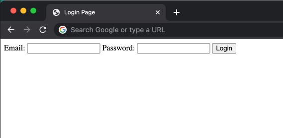
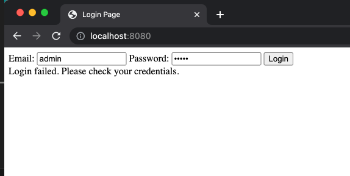
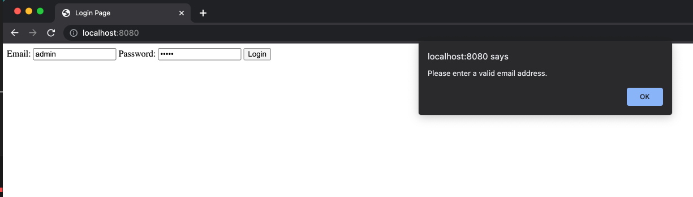
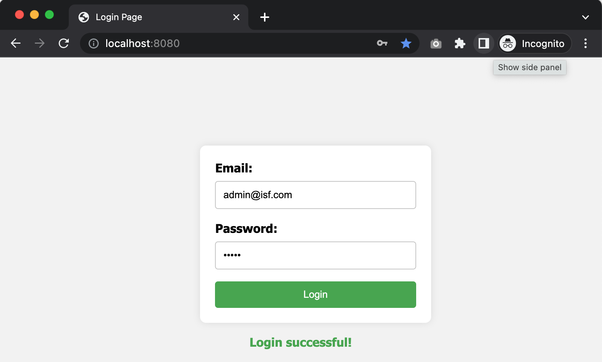

# ISF
Infonet Security Fundamentals
# Lab 6: Create the simplest HTTP server with PHP

### Step 1: Simplest HTML Form (Login)

#### 1.1 Create HTML File

Create a file named `index.html` and add the following content:

```html
<!-- index.html -->

<!DOCTYPE html>
<html lang="en">

<head>
    <meta charset="UTF-8">
    <meta name="viewport" content="width=device-width, initial-scale=1.0">
    <title>Login Page</title>
</head>

<body>
    <div>
        <!-- Simple login form with email and password fields -->
        <form method="post">
            <label for="email">Email:</label>
            <input type="text" id="email" name="email" required>
            <label for="password">Password:</label>
            <input type="password" id="password" name="password" required>
            <button type="submit">Login</button>
        </form>
    </div>
</body>

</html>
```
This HTML file creates a basic login form with email and password fields. The form uses the post method to send data to the server when the user submits the form.

#### 1.2 View in Web Browser

Use browser's "Open File" or "Open..." option to open the index.html file.



Now, you can view the simple HTML page.

### Step 2: Create The First PHP Page

#### 2.1 Create PHP File

Create a file named `index.php` and add the following content:

```php
<!-- index.php -->

<!DOCTYPE html>
<html lang="en">

<head>
    <meta charset="UTF-8">
    <meta name="viewport" content="width=device-width, initial-scale=1.0">
    <title>Login Page</title>
</head>

<body>
    <div class="container">
        <!-- Login form  -->
        <form method="post">
            <label for="email">Email:</label>
            <input type="text" id="email" name="email" required>
            <label for="password">Password:</label>
            <input type="password" id="password" name="password" required>
            <button type="submit">Login</button>
        </form>

        <?php
        // Check if the form is submitted
        if ($_SERVER["REQUEST_METHOD"] == "POST") {
            // Retrieve the user's email from the form
            $email = $_POST["email"];
            $password = $_POST["password"];

            // Basic validation
            if ($email === "admin@isf.com" && $password === "admin") {
                $result = "Login successful!";
                $class = "success";
            } else {
                $result = "Login failed. Please check your credentials.";
                $class = "error";
            }

            // Display the result
            echo "<div id='loginResult' class='$class'>$result</div>";
        }
        ?>
    </div>
</body>

</html>
```
This PHP file checks the submitted email and password, and based on the credentials, it displays a success or error message. The result is dynamically added to the HTML using PHP.



Now, you can interact with the form by entering values into the email and password fields.

### Step 3: Add JavaScript Client-side Validation

#### 3.1 Update the PHP File

Update the PHP File with the following content:

```html
<!-- index.php -->

<!DOCTYPE html>
<html lang="en">

<head>
    <meta charset="UTF-8">
    <meta name="viewport" content="width=device-width, initial-scale=1.0">
    <title>Login Page</title>
    <script>
        // JavaScript function for client-side validation
        function validateForm() {
            var email = document.getElementById("email").value;
            var password = document.getElementById("password").value;

            var emailRegex = /^[^\s@]+@[^\s@]+\.[^\s@]+$/;
            if (!emailRegex.test(email)) {
                alert("Please enter a valid email address.");
                return false;
            }

            return true;
        }
    </script>
</head>

<body>
    <div>
        <!-- Login form with PHP validation and JavaScript client-side validation -->
        <form method="post" onsubmit="return validateForm()">
            <label for="email">Email:</label>
            <input type="text" id="email" name="email" required>
            <label for="password">Password:</label>
            <input type="password" id="password" name="password" required>
            <button type="submit">Login</button>
        </form>

        <?php
        // Check if the form is submitted
        if ($_SERVER["REQUEST_METHOD"] == "POST") {
            // Retrieve the user's email from the form
            $email = $_POST["email"];
            $password = $_POST["password"];

            // Basic validation
            if ($email === "admin@isf.com" && $password === "admin") {
                $result = "Login successful!";
                $class = "success";
            } else {
                $result = "Login failed. Please check your credentials.";
                $class = "error";
            }

            // Display the result
            echo "<div id='loginResult' class='$class'>$result</div>";
        }
        ?>
    </div>
</body>

</html>
```
In this step, JavaScript is added for client-side validation. The validateForm function checks if the entered email is in a valid format using a regular expression. If the email is invalid, it displays an alert and prevents the form from being submitted. This provides an additional layer of validation on the client side.



It prevents the form from submitting if the email is invalid.

### Step 4: Add CSS to Enhance the Visual Appearance 

#### 4.1 Create CSS File

Create CSS file named styles.css and add following content:

```css
/* styles.css */

body {
    font-family: 'Segoe UI', Tahoma, Geneva, Verdana, sans-serif;
    background-color: #f4f4f4;
    margin: 0;
    display: flex;
    align-items: center;
    justify-content: center;
    height: 100vh;
}

div {
    text-align: center;
}

form {
    margin-top: 20px;
}

label {
    display: block;
    margin-bottom: 8px;
    font-weight: bold;
}

input {
    width: 200px;
    padding: 10px;
    margin-bottom: 16px;
    border: 1px solid #ccc;
    border-radius: 4px;
    box-sizing: border-box;
}

button {
    background-color: #4caf50;
    color: white;
    padding: 10px 15px;
    border: none;
    border-radius: 4px;
    cursor: pointer;
}

button:hover {
    background-color: #45a049;
}

#loginResult {
    margin-top: 16px;
    font-weight: bold;
    color: #333;
}
```

#### 4.2 Link the CSS File in index.php

```html
<!-- index.php -->
...
    <title>Login Page</title>
    <!-- Add the following line to link the CSS file -->
    <link rel="stylesheet" href="styles.css"> 
    <script>
        ...
    </script>
...
```


